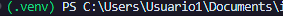
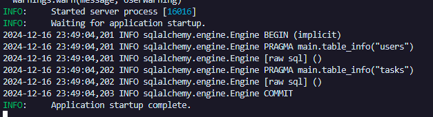
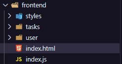
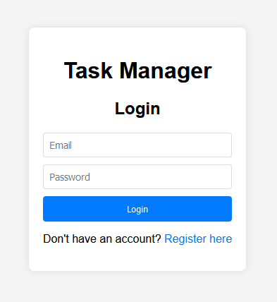
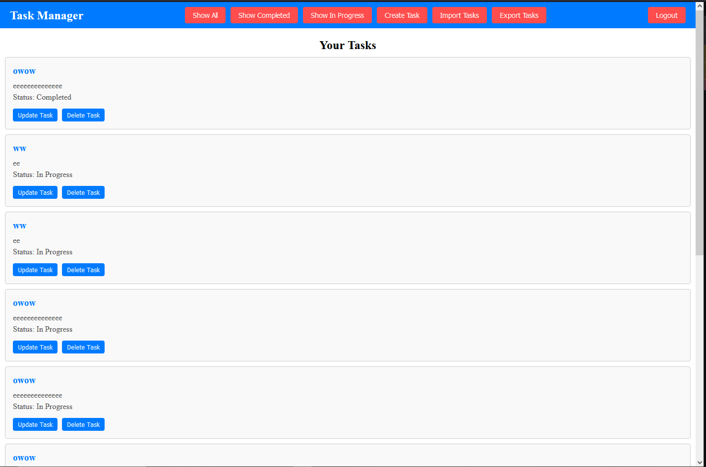
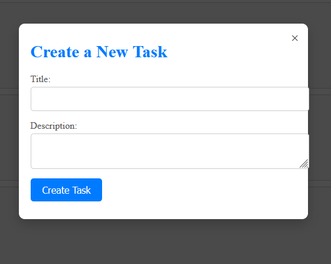
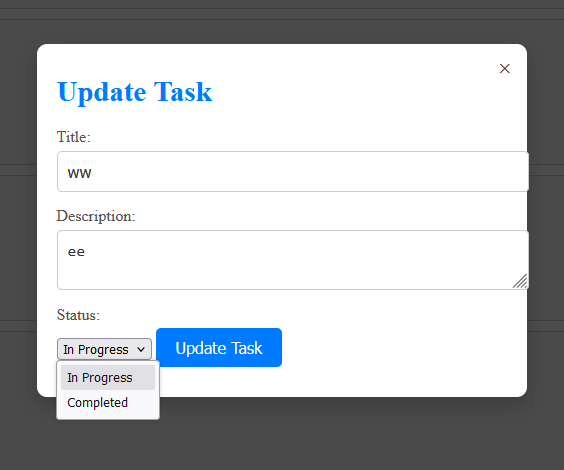
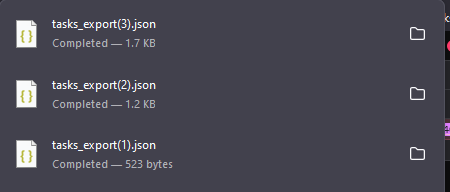
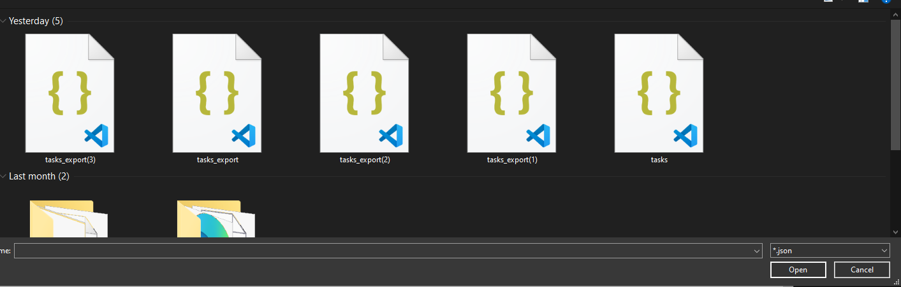

# Gestor de Tareas en Python

## Descripción
Este proyecto es una aplicación de gestión de tareas desarrollada en Python. Permite realizar operaciones básicas como:
- Agregar tareas.
- Listar tareas con su estado (completado o pendiente).
- Marcar tareas como completadas.
- Eliminar tareas.
- Exportar tareas a un archivo JSON.
- Importar tareas desde un archivo JSON.

La aplicación cuenta con un **backend** en **FastAPI** y una interfaz **frontend** sencilla en HTML, CSS y JavaScript.

---

## Características
1. **Backend**: Implementado en Python usando FastAPI y SQLAlchemy.  
2. **Base de Datos**: SQLite manejada directamente en el programa.  
3. **Frontend**: HTML y JavaScript que permite interactuar con la API.  
4. **Autenticación**: Login y registro de usuarios.  

---

## Requisitos
- Python 3.8 o superior.  
- Entorno virtual (opcional pero recomendado).  
- Navegador web moderno para ejecutar el **frontend**.

---

## Instalación y Ejecución

### 1. Clonar el repositorio
```
git clone https://github.com/BonIcy/taskManagerPython
```
### 2. Configurar el entorno virtual

En la carpeta raíz ./taskManagerPython, ejecutar:
```
python -m venv .venv
.\.venv\Scripts\Activate
```
<<<<<<< HEAD
=======
Al ejecutar el ultimo comando deberia aparecer "(.env)" antes de la ruta en la terminal



>>>>>>> frontend

### 3. Instalar las dependencias
```
pip install sqlalchemy
pip install aiosqlite
pip install fastapi
pip install uvicorn
pip install werkzeug
pip install pydantic
pip install fastapi[all]
pip install pyjwt
```
### 4. Ejecutar el Backend

En la misma ruta ./taskManagerPython, ingresar a la carpeta backend y ejecutar:
```
cd backend
python main.py
uvicorn main:app --reload
```
<<<<<<< HEAD
=======

Luego de la ejecución de los comandos anteriores, deberia aparecer el siguiente estado en consola, indicando que se inicializó el servidor local de FastAPI en http://127.0.0.1:8000.


>>>>>>> frontend

Esto iniciará el servidor local de FastAPI en http://127.0.0.1:8000.

### 5. Ejecutar el Frontend

<<<<<<< HEAD
=======
### 5. Ejecutar el Frontend

>>>>>>> frontend
Una vez el backend esté activo:

    Abre el archivo index.html ubicado dentro de la carpeta frontend en cualquier navegador web.
    Accede a la interfaz, primero deberas registrarte e iniciar sesión para acceder a la interfaz del administrador de tareas
<<<<<<< HEAD
=======

El archivo index.html se encuentra al siguiente nivel de carpetas



Al ejecutarse nos va a redireccionar a un login, en donde podemos tambien registrarnos oprimiendo el texto "Register here"



Una vez iniciada la sesión correctamente, podemos observar todas nuestras tareas, y una navbar con funciones como filtrar por estado de tarea, importar o exportar, y cerrar sesión



Para crear una tarea se oprime el botón "Create Task" en la navbar, y se abre el siguiente modal, en donde el estado de la tarea será por defecto en "Pendiente" o "In Progress"



Para actualizar, seria parecido a como la creamos, pero aqui si podemos modificar el estado de la tarea para marcarla como Completada



Si exportamos las tareas se descargará un archivo llamado task_export.json



El botón de importar nos va a abrir un input de tipo file o archivo, en donde podemos seleccionar un json para agregar las tareas a nuestra lista


>>>>>>> frontend
